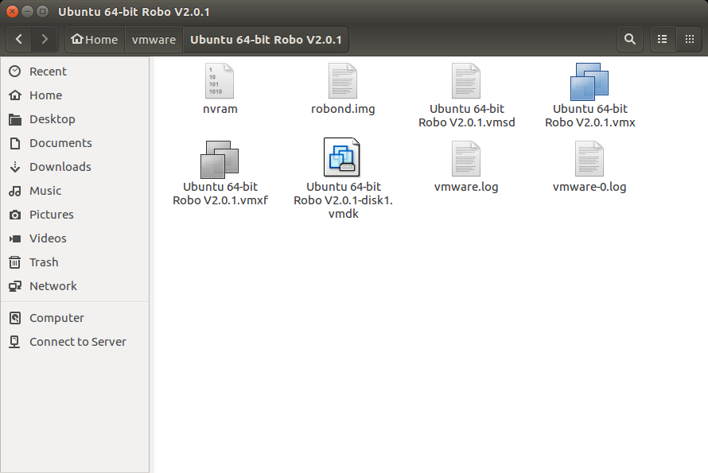
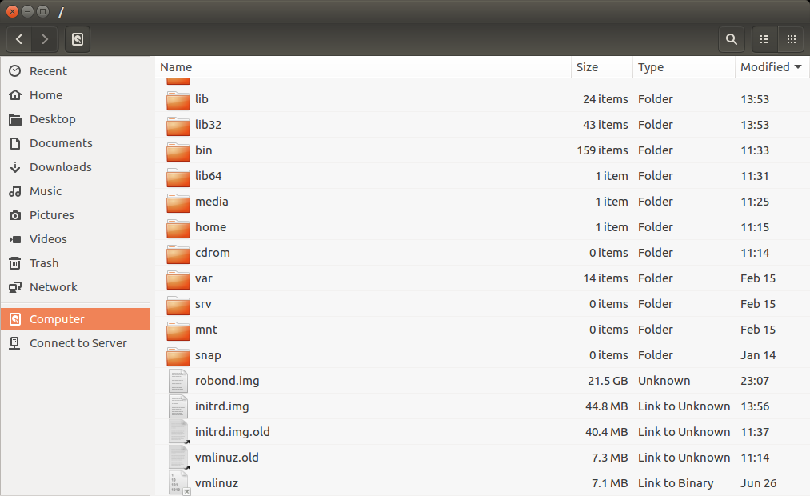
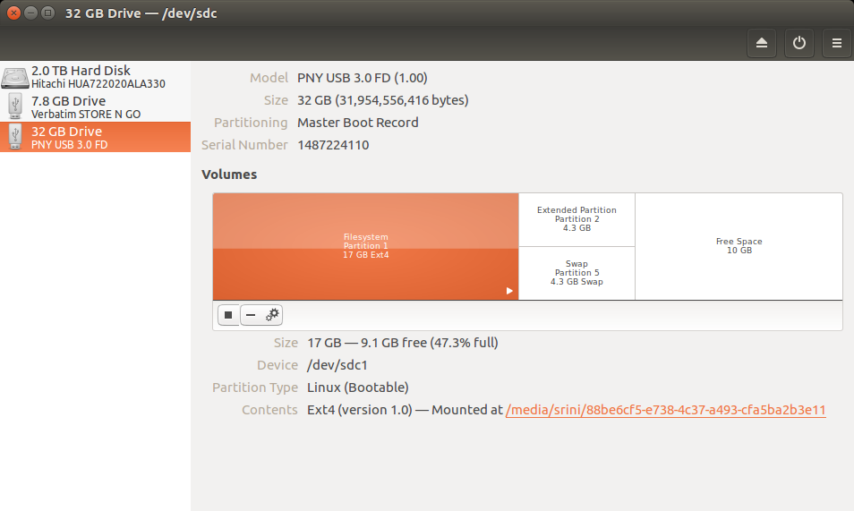
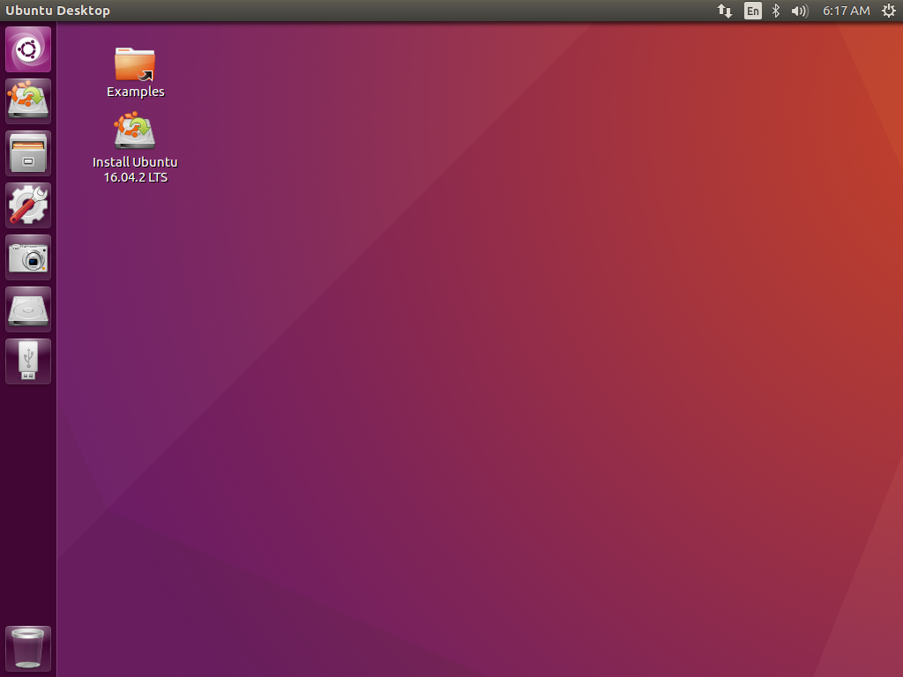
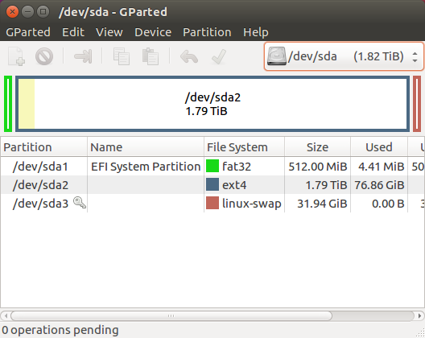
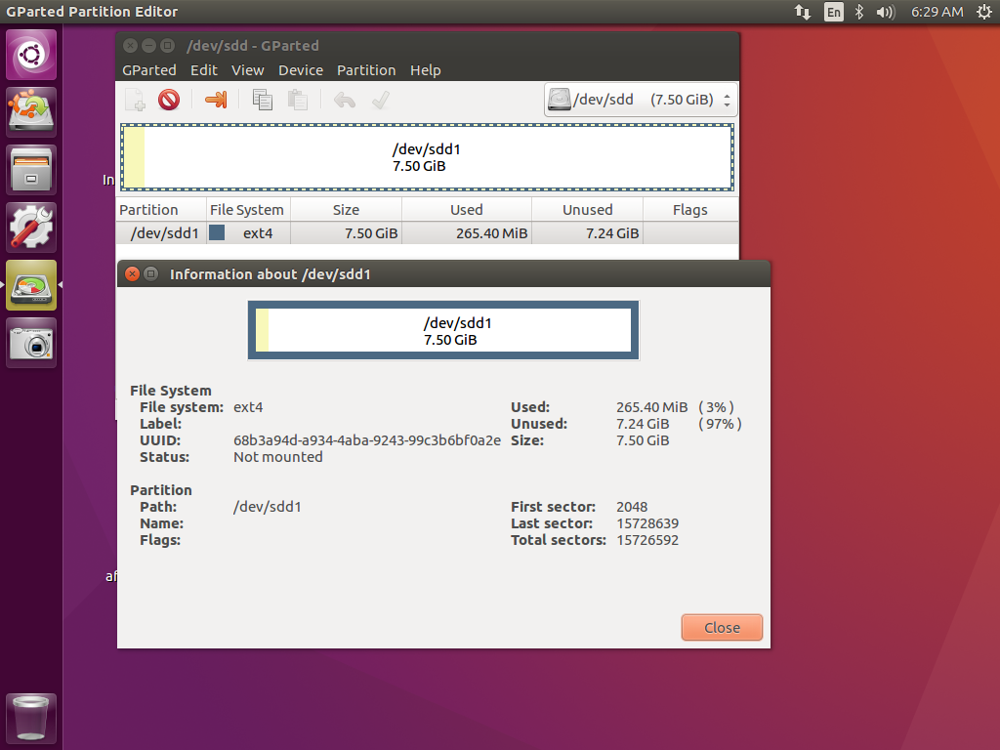
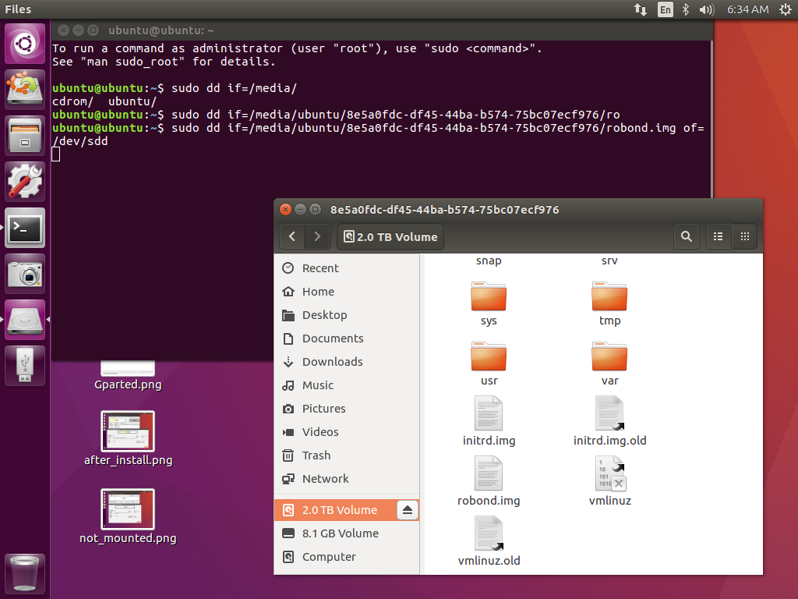
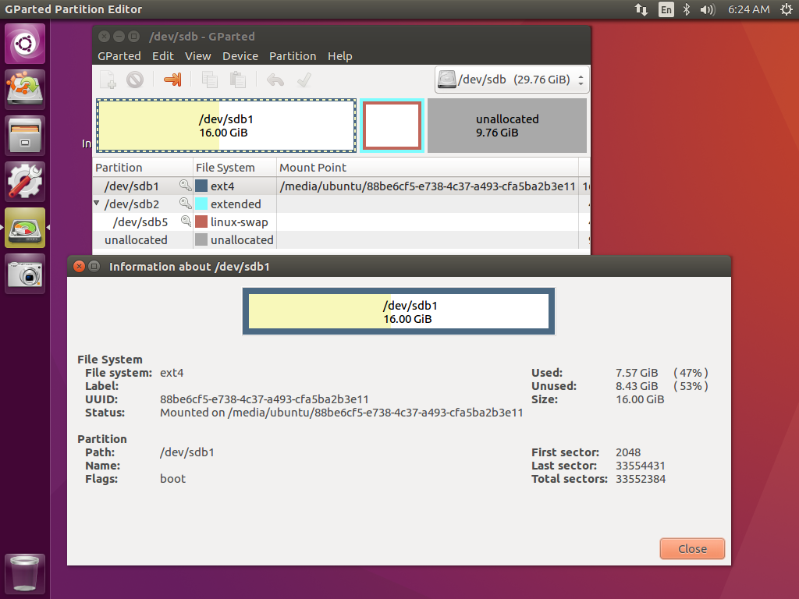
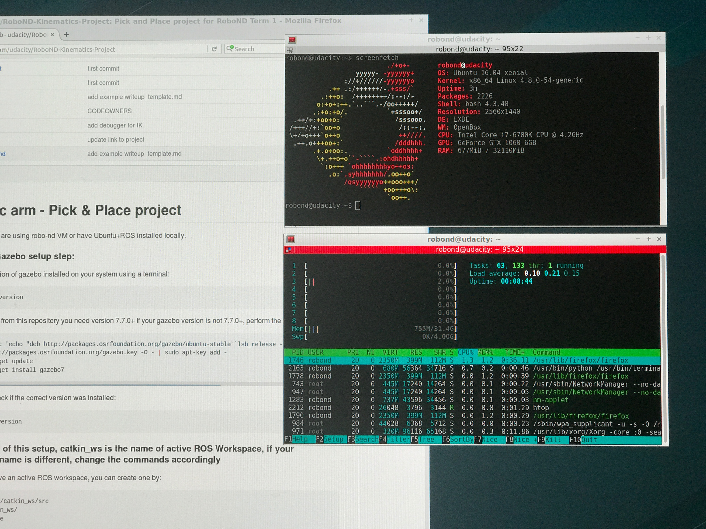

# Guide to Port the RoboND VM to a Bootable USB drive

## Why do this?
Lot of classmates in RoboND are experiencing slow and laggy performance of Gazebo inside the VM.
Some of us tried to solve this by installing ROS natively on Ubuntu. However, it is a lot of steps and
only a few students were able to run the project succesfully.

The VM comes with all tools installed and setup perfectly to work out of the box.
Easiest way is to just take the VM and boot into it natively. This guide does exactly that.

## Requirements

1.  A live Ubuntu USB drive (or Ubuntu Live CD)
2.  Another USB drive greater than 22 GB (how about a 32GB USB drive?)
3.  A host system running Ubuntu (I am sure it can be done on Windows or MacOS but Ubuntu is all I got.)
4.  A working RoboND VM in VMWare Player (Can be done without this. Better to make sure VM is working before we copy it)

## Overview

The RoboND VM comes in the form of a ".ova" file. This file can be loaded using the VMWare player.
Inside this ".ova" file is a ".vmdk" file that VMWare Player uses as storage.
The ".vmdk" file has the LUbuntu OS and all ROS software installed in it.

We can convert this ".vmdk" file (virtual storage) into a ".img" file which can be
written to a physical storage device such as an USB drive.

That's it. We can then connect this USB drive to a real computer and boot from it.

Thanks to the beautiful people on the Internet that published these two posts
that I used to create this guide.

-   [Migrate from a virtual machine (VM) to a physical system](https://askubuntu.com/questions/32499/migrate-from-a-virtual-machine-vm-to-a-physical-system)
-   [Converting OVA for use with KVM / QCOW2](http://edoceo.com/notabene/ova-to-vmdk-to-qcow2)

If you are Pro Linux user, you already know what to do.
But if you are a baby Ubuntu user like me, follow along; At your own risk of-course.


## Step-by-Step Guide

### Step 1 - Convert ".ova" or ".vmdk" to ".img"

1.  Make sure you are able to use VMWare Player and the provided ".ova" file to load the VM.

2.  Shutdown the VM. Not Suspend but Shutdown.

3.  In your `~/vmware/Ubuntu 64-bit Robo V2.0.1` folder, you'll find the ".vmdk" file called
`Ubuntu 64-bit Robo V2.0.1-disk1.vmdk`. Make sure it's there.

Below screenshot shows `robond.img` already present here. It will be actually created in step 4 below.



**Note:**

```
Opening the ".ova" file using VMWare Player and shutting down the VM creates the ".vmdk" file for us.
".vmdk" file can be extracted from the ".ova" file without VMWare Player using the tutorial mentioned in the Overview section.
I haven't done it myself. Let me know if it works.
```

4.  Open a terminal and run the following commands:

```bash
$ cd ~/vmware/Ubuntu\ 64-bit\ Robo\ V2.0.1/
$ sudo apt install qemu-kvm
$ qemu-img convert Ubuntu\ 64-bit\ Robo\ V2.0.1-disk1.vmdk -O raw robond.img
```

5.  This step is optional; but I like to copy the newly created `robond.img` file to the root for ease of navigation later.
while still in the same terminal window, use the following command to copy it to the root.

```bash
$ sudo cp -P robond.img /
```




### Step 2 - Write ".img" file to a USB drive

1.  Prepare the USB drive that we are going to use to port our VM to.
Open the `Disks` app on Ubuntu to format the entire USB drive to one partition and Ext4 format.

**Note:**

```
I am not sure if the above step is necessary but that is what I did. If someone knows for sure, please let me know.
```

In the screenshot below, 2TB drive is my regular Ubuntu Installation, 8GB drive is Ubuntu Live USB, and 32 GB drive is RoboND LUbuntu.
Multiple partitions are present in the 32GB drive because I took the screenshot after completing the whole process.
Initially, it will be one big orange block.



2.  Have both the Live Ubuntu USB drive and the 32GB empty USB drive connected to your computer and reboot.

3.  Boot using the Live Ubuntu USB and select `Try Ubuntu without Installing`

The Hard Disk like icon below the Camera icon and above the USB icon is your main Ubuntu OS drive, double-click and open it to make sure it is mounted.



4.  Once inside, make sure your actual Ubuntu OS drive is mounted and the 32GB USB drive is not mounted.
You can check that by using the `Gparted` app.

`Gparted` looks like the image below. If you are not careful, you can delete or modify partitions on a wrong device and loose all your data.
In the top right corner there is a drop-down to select different drives that are connected.
In this screenshot, it is showing the device `/dev/sda` and partitions inside it.



Since I only have one 32GB drive and I already used it, I found another 8GB(7.50 GiB) drive to show how it looks.
Pretend the device `/dev/sdd` is your 32GB drive. It has one single `/dev/sdd1` partition in `ext4` format.
If you right-click that `ext4` line and select `information`, it opens a new window as shown.
Here you can see that `Status: Not mounted`. It should look like that.



Once you verified that your 32GB drive is not mounted, close the `Gparted` app.

5.  Open a terminal window and type the following command

**Note:**
```
In Linux, drives are listed as "/dev/sda", "/dev/sdb", and so on ...
In the command below for "/dev/sdX" choose the name of your 32GB USB drive as shown in the "Gparted" app.
Whatever device you choose will be cleared and replaced with RoboND VM. Please be careful here.
```

```bash
$ sudo dd if=/media/ubuntu/s0m3-l0ng-alph4-num3r1c-c0d3-uuid/robond.img of=/dev/sdX
```



6.  Wait for it to transfer the ".img" to your 32GB drive. After it is done,
shutdown and disconnect the Ubuntu Live USB drive.

Below is the state of my 32GB drive after the copy.



7.  Boot in to the 32GB USB drive and your LUbuntu with all RoboND tools is running native on your computer!




## Update:
After writing the whole thing, I realized maybe all you need is a Live USB drive and an empty 32GB USB drive.
1. Boot using Live USB
2. Download the VM image to the live USB
3. Extract the `.vmdk` from `.ova` as shown in  [Converting OVA for use with KVM / QCOW2](http://edoceo.com/notabene/ova-to-vmdk-to-qcow2)
4. Convert `.vmdk` to `.img`
5. Write `.img` to the 32GB drive

Someone please try this. If this works, Windows and Mac users can also use this.
